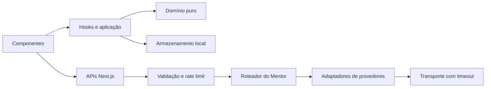

# Arquitetura

O RoutineOS usa módulos por funcionalidade. Componentes coordenam interação; hooks sincronizam React com fontes externas; funções de domínio são puras; APIs validam entrada antes de chamar integrações; `lib/storage.ts` é a fachada compatível do armazenamento local.

## Decisões

- IDs, chaves do localStorage, contratos de API e ordem de fallback são estáveis.
- Rotina ausente significa usuário novo; `DEFAULT_ROUTINE` é apenas representação vazia em memória.
- A sincronização de trilhas usa assinatura de rotina e mescla estado do usuário por tema.
- Propostas do Mentor passam por normalização e viram rascunho; salvar continua sendo decisão do usuário.
- `wrap-break-word` é preservado como contrato visual.

## Fronteiras ainda grandes

O construtor mantém gestos e três composições responsivas no mesmo componente porque separá-los de uma vez elevaria o risco visual. Novas regras devem ir para `features/routine/domain`; novos gestos devem receber testes antes de extração.

## Extensão futura: edição pelo Mentor

Não está implementada. O caminho previsto é: analisar a rotina existente → produzir uma ação discriminada de proposta → validar → calcular diff puro → criar rascunho → mostrar diff → aguardar confirmação → aplicar no construtor → salvar manualmente. A ação futura não deve acessar armazenamento nem interface diretamente.

## Divisões concluídas

- `lib/storage.ts` segue como fachada pública; normalizadores ficam em `lib/storage/storage-validators.ts`.
- `study-trail-catalog.ts` contém catálogo e enriquecimento; `study-trail.ts` mantém extração, merge e fallback.
- `mentor-routine-proposal-validation.ts` contém parsing e normalização; o módulo original preserva os exports.
- `routine-builder-helpers.ts` contém tipos, geometria e cálculos do construtor.
- `trails-content.tsx` contém a apresentação; `trails-view.tsx` coordena estado e persistência.

O JSX responsivo do construtor ainda é grande. Uma segunda divisão foi evitada nesta etapa porque exigiria atravessar dezenas de estados e refs de gesto; esse risco residual não deve ser ocultado.
