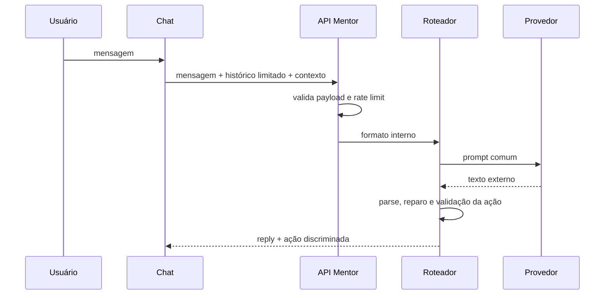

# Mentor IA

## Fluxo

No automático: Gemini, Groq, OpenRouter e OpenAI. Falhas temporárias respeitam `Retry-After` e cooldown; 401/403 não avançam no modo manual. Todos usam timeout comum e retornam `MentorApiResponse`.

O parser aceita texto normal ou JSON estruturado, repara controles inválidos em strings e nunca mostra JSON truncado. Ações desconhecidas, tipos inventados, horários inválidos, sobreposição não tratada e ações destrutivas são recusados.

Logs contêm evento, provedor, duração, status e motivo técnico; nunca chave, cabeçalho, prompt, resposta ou contexto. Métricas locais contam tentativas, sucessos, falhas e duração acumulada.

`/provedores` faz uma chamada mínima e isolada para cada API configurada, sem enviar o prompt completo, o histórico ou o contexto do usuário. A verificação pode consumir uma pequena parte da cota. Em erros HTTP, a interface mostra apenas status e uma classificação segura, sem reproduzir mensagens brutas do provedor. Testes automatizados sempre mockam `fetch`.

O corpo é limitado durante a leitura do stream, antes do parse. A validação profunda descarta campos extras e rejeita estruturas, horários, durações, URLs, arrays e profundidade inválidos antes da construção do prompt. O fallback permanece Gemini → Groq → OpenRouter → OpenAI, com seleção manual preservada.
